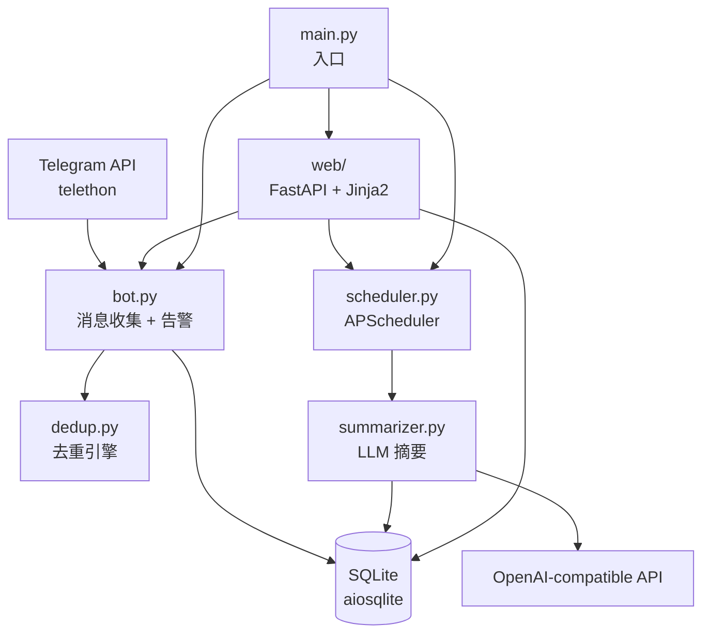

# tg-lurker

Telegram 群聊监控与摘要系统。自动收集已加入群组的消息，通过 LLM 生成每日摘要，支持广告去重、关键词告警、上下文回溯。

## 架构



## 技术栈

| 层 | 技术 |
|---|------|
| Telegram 客户端 | telethon 1.37 (userbot) |
| 数据库 | SQLite + aiosqlite (WAL mode) |
| LLM | openai SDK (兼容 DeepSeek 等) |
| Web UI | FastAPI + Jinja2 + HTMX |
| 定时任务 | APScheduler |
| 部署 | Docker (多阶段构建) |

## 模块导航

| 模块 | 路径 | 职责 |
|------|------|------|
| 入口 | `main.py` | 启动 Bot/Scheduler/Web，信号处理 |
| 配置 | `config.py` | 环境变量加载，`Config` frozen dataclass |
| Bot | `bot.py` | Telegram 连接、消息处理、告警检测 |
| 数据库 | `database.py` | Schema 定义、CRUD、上下文窗口管理 |
| 去重 | `dedup.py` | SHA256 + trigram 相似度 + 关键词黑名单 |
| 摘要 | `summarizer.py` | LLM 调用、消息截断、引用解析 |
| 调度 | `scheduler.py` | Cron 触发摘要、重试、消息清理 |
| Web | `web/` | 认证、路由、模板 (dashboard/groups/summaries/messages/settings/alerts) |
| Mock | `mock/` | 开发用 mock bot + seed data |
| Scripts | `scripts/` | Docker 多架构推送脚本 |

## 开发

```bash
# 安装依赖
pip install -r requirements.txt

# 本地开发（mock 模式，无需 Telegram 登录）
python -m mock.run_web

# 生产运行
cp .env.example .env  # 填写配置
python main.py

# Docker
docker compose up --build
```

## 关键设计决策

- **Userbot 模式**: 使用 telethon 以用户身份加入群组，非 Bot API
- **消息引用**: 摘要中使用 `[m:消息ID]` 标注来源，支持上下文回溯
- **LRU 上下文清理**: context_messages 表有行数上限，按 last_accessed_at 淘汰
- **去重策略**: 精确哈希 + trigram 相似度(0.85) + 关键词黑名单(命中>=2)
- **Session 认证**: itsdangerous 签名 cookie，CSRF double-submit
- **设置热更新**: LLM 配置、告警关键词等存 settings 表，运行时可改

## 数据库 Schema

核心表: `messages`, `summaries`, `context_windows`, `context_messages`, `monitored_groups`, `settings`, `blocked_senders`, `alerts`

## 环境变量

必填: `API_ID`, `API_HASH`, `OWNER_ID`, `LLM_BASE_URL`, `LLM_API_KEY`, `WEB_PASSWORD`

可选: `LLM_MODEL`, `LLM_API_FORMAT`, `LLM_PROXY_URL`, `SUMMARY_CRON`, `PROXY_TYPE/HOST/PORT`, `WEB_PORT`, `TZ`
